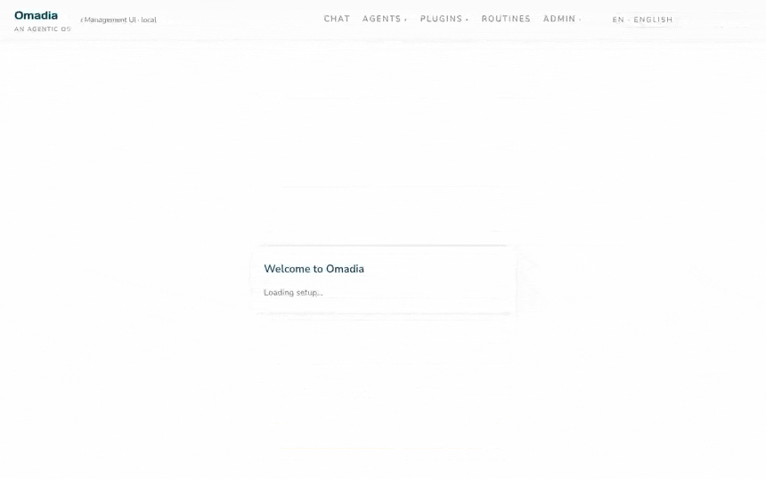

<div align="center">

# omadia

### Spin up a team of AI agents that does the work — on your own server, with a receipt for every action.

omadia is a self-hostable **agentic OS**: compose multi-agent teams from signed
plugins, run them on one machine, and get an auditable trail for everything they do.
Your LLM key. Your data. Your compliance story.



<sub>Describe an agent in plain words → the builder generates it → try it out. No code.</sub>

[](LICENSE)
[](#status--roadmap)
[](#-60-second-quickstart)
[](https://www.typescriptlang.org/)
[](CONTRIBUTING.md)
[](https://github.com/byte5ai/omadia/stargazers)

[**Website**](https://omadia.ai) · [**Quickstart**](#-60-second-quickstart) · [**Why omadia?**](#why-omadia) · [**Docs**](docs/) · [**Contributing**](CONTRIBUTING.md)

</div>

---

## Why you'll want to ⭐ this

- 🔒 **Self-hosted and yours.** Bring your own LLM key, run on a single machine
  with Docker Compose, and own 100% of the data. No SaaS lock-in,
  EU/GDPR-ready by design.
- 🤖 **Agent *teams*, not one chatbot.** An orchestrator routes each turn to the
  right specialized plugin agent — channels, integrations, tools, and capability
  providers all snap together behind one stable API.
- 🧾 **Every action leaves a receipt.** Full per-run trace and call-stack viewer
  for each agent run, so you can audit, debug, and prove what happened — built in,
  not bolted on.

## ⚡ 60-second quickstart

```bash
git clone https://github.com/byte5ai/omadia.git && cd omadia

# 1. Bring up the whole stack (postgres + middleware + admin UI).
#    Every env var has a sane local default — no config needed to start.
docker compose up -d

# 2. Open the admin UI and complete the first-admin wizard.
#    The /setup wizard collects your LLM key and stores it encrypted in the vault.
open http://localhost:3333
```

That's it — `docker compose up -d`, open the UI, set your LLM key in the wizard,
and run your first agent team. The next section is the 90-second "wow moment".

## 🚀 First run: from prompt to audit receipt

The point of omadia clicks the moment you watch a team of agents do real work and
hand you a receipt for it:

1. **`docker compose up -d`** — postgres, middleware, and the admin UI come up together.
2. **Open `http://localhost:3333`** and finish the first-admin `/setup` wizard.
3. **Start a demo agent team** from a single prompt in the web chat.
4. **Watch it work** — the orchestrator streams turns and dispatches tools across
   the agents in the team.
5. **Open the run's trace** — the per-run **call-stack viewer** is your audit
   receipt: every step, every tool call, every decision, replayable.

## Why omadia?

omadia optimizes for what matters once an agent system leaves a laptop —
ownership, auditability, and dropping into a real enterprise stack, not just
"how many demos can it run." What you get, first-class:

- ✅ **Self-hosting on a single machine** — `docker compose up`, no SaaS dependency
- ✅ **Own your data** — your Postgres, your LLM key; nothing leaves your box
- ✅ **Built-in audit trail / receipts** — per-run trace + call-stack viewer for every agent run
- ✅ **Signed plugin distribution** — verifiable plugin packages, not arbitrary npm at runtime
- ✅ **EU / GDPR-ready posture** — single-tenant and self-hosted, data-resident by design
- ✅ **Multi-agent coordination** — an orchestrator routes each turn across specialized agents
- ✅ **Enterprise integrations** — Microsoft 365, Odoo, Confluence, Teams, Telegram
- ✅ **Bring-your-own LLM key** — provider-pluggable

## What's in the box

- **Plugin runtime** — channels, integrations, tools, sub-agents, capability
  providers; everything is a plugin behind a stable API surface
  ([`@omadia/plugin-api`](middleware/packages/plugin-api))
- **Builder** — UI-driven plugin authoring with codegen, slot-typecheck,
  in-process ESLint auto-fix, and a runtime smoke harness
- **Knowledge graph** — pgvector-backed (Postgres) with an in-memory
  alternative for tests
- **Channels** — web-chat (admin UI) is in-tree; Teams + Telegram are
  shipped as separately-distributed plugin ZIPs
- **Auth** — multi-provider login (local password + OIDC), per-provider
  user table, admin UI for provider toggle and user management
- **Routines** — user-authored cron-triggered agent runs with full per-run
  trace + call-stack viewer

## Architecture

```
         ┌────────────────────────────────────────────────────────────┐
         │                       Channels                             │
         │  web-chat   Teams   Telegram   …                           │
         └────────────────────┬───────────────────────────────────────┘
                              │  ChannelSDK (SemanticAnswer)
                              ▼
         ┌────────────────────────────────────────────────────────────┐
         │                      Orchestrator                          │
         │  routes turns to agents, manages tool dispatch, streaming  │
         └────────────────────┬───────────────────────────────────────┘
                              │  ctx (PluginContext)
                              ▼
         ┌────────────────────────────────────────────────────────────┐
         │                        Plugins                             │
         │  agents  ·  tools  ·  capability providers  ·  integrations│
         └────────────────────┬───────────────────────────────────────┘
                              │
        ┌─────────────────────┴────────────────────────────┐
        ▼                     ▼                            ▼
  Knowledge Graph       Embeddings                  Vault (secrets)
  (Postgres + pgvector) (Ollama / API)              (AES-256-GCM file)
```

A more detailed walk-through of the plugin loading sequence, capability
registry, and the multi-provider authentication layer lives under
[`docs/`](docs/).

### Optional Compose profiles

```bash
# Mermaid / PlantUML / Vega rendering for the diagrams plugin
docker compose -f infra/docker-compose.yml --profile diagrams up -d

# In-tenant embeddings via Ollama (no external API required)
docker compose -f infra/docker-compose.yml --profile embeddings up -d

# Presidio NER sidecar for the privacy-proxy detector plugin
docker compose -f infra/docker-compose.yml --profile privacy-presidio up -d

# All optional profiles in one command
docker compose -f infra/docker-compose.yml \
  --profile diagrams --profile embeddings --profile privacy-presidio up -d
```

> **Enable diagram rendering** by generating a secret and adding it to
> `middleware/.env` as `DIAGRAM_URL_SECRET` (only needed alongside
> `KROKI_BASE_URL` + `BUCKET_NAME`): `openssl rand -hex 32`.

## Plugin development

**Start here → [`byte5ai/omadia-plugin-starter`](https://github.com/byte5ai/omadia-plugin-starter)** —
a ready-to-fork template for building your own omadia plugin. Clone it, fill in
your logic against [`@omadia/plugin-api`](middleware/packages/plugin-api), and ship.

omadia plugins are self-contained ZIP files that the operator uploads through
the admin UI. The platform never trusts external npm registries at runtime —
plugins ship `node_modules` baked in (or use the platform's standard library
via `@omadia/plugin-api`). Two reference plugins are also shipped in-tree as
starting points:

- [`agent-reference-maximum`](middleware/packages/agent-reference-maximum) —
  exercises every capability in the plugin API
- [`agent-seo-analyst`](middleware/packages/agent-seo-analyst) — a smaller,
  focused tool-only example

The Builder UI walks operators through cloning either reference, slot-filling
the differentiating logic, and verifying with the smoke runner before install.

## Deployment

- **Local / single-tenant** — `docker compose up`, see Quickstart above
- **Bring-your-own** — the runtime is a stock Node + Postgres app; any host
  capable of running both works (Kubernetes, ECS, plain VM).

> **Required production secret.** The shipped image runs with
> `NODE_ENV=production`, which makes `VAULT_KEY` mandatory at boot — without
> it the middleware refuses to start (this is intentional; the dev fallback
> writes the master key into the data volume, which is not safe at rest).
> Generate one with `openssl rand -base64 32` and wire it as a platform
> secret before the first deploy. The bundled `docker-compose.yaml` pins
> `NODE_ENV=development` so the dev fallback stays available for local
> `docker compose up` without configuration; drop that override (and set
> `VAULT_KEY` in `.env`) when you re-use the compose file as a starting
> point for a non-local deploy.

## Status & Roadmap

> **Status — pre-1.0.** Public preview. APIs and database schemas may break
> between minor versions until `1.0.0`. Production use of the OSS distribution
> is supported but the upgrade path is hand-rolled today; an automated
> migration runner is on the v1.0 roadmap.

Stability promises are **scoped to the documented plugin API only**; everything
else (database schema, internal service surfaces, admin-UI routes) may evolve
without notice until `1.0.0`.

Active development tracks:

- **Plugin marketplace** — discovery + signed-package distribution (post-1.0)
- **Multi-tenant hosting** — out of scope for v1; a separate fork is planned
- **Web-IDE for plugin development** — moves the Builder authoring loop into
  the management UI without round-tripping through ZIP uploads (post-1.0)

## License

[MIT](LICENSE) — Copyright (c) 2026 byte5 GmbH

Third-party dependency licenses and notices are documented in
[`THIRD_PARTY_NOTICES.md`](THIRD_PARTY_NOTICES.md). The dependency tree is
free of GPL, AGPL, and SSPL packages; weak-copyleft components (LGPL via
`sharp-libvips`, MPL-2.0 via `axe-core` / `lightningcss` / `dompurify`) are
used as documented unmodified dependencies.

## Contributing

See [`CONTRIBUTING.md`](CONTRIBUTING.md) for the dev setup, commit-message
convention, and pull-request workflow. The
[`CODE_OF_CONDUCT.md`](CODE_OF_CONDUCT.md) (Contributor Covenant 2.1) applies
to all interactions in issues, pull requests, and discussions.

## Security

Found a vulnerability? **Please do not open a public issue.** See
[`SECURITY.md`](SECURITY.md) for the coordinated-disclosure process and the
private contact channel.

## Maintainership

omadia is maintained by [byte5 GmbH](https://byte5.de) under the GitHub
organisation [`byte5ai`](https://github.com/byte5ai). Outside contributions
are welcome — see [`CONTRIBUTING.md`](CONTRIBUTING.md).
