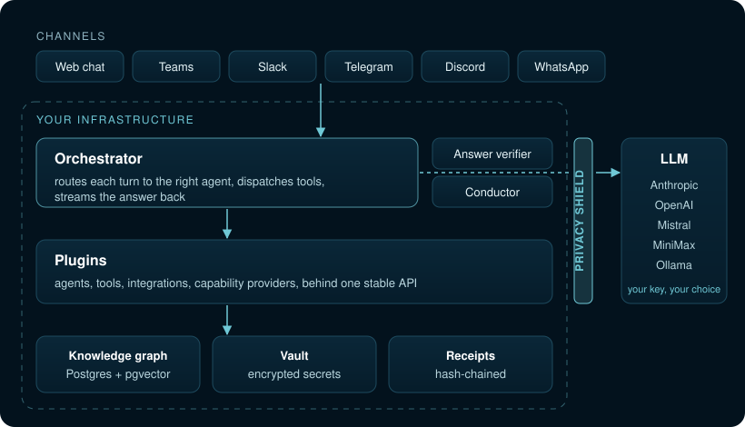

<div align="center">


### An Agentic OS for professionals

[](LICENSE)
[](#status-and-roadmap)
[](#quickstart)
[](https://www.typescriptlang.org/)
[](CONTRIBUTING.md)
[](https://github.com/byte5ai/omadia/stargazers)

[**Website**](https://omadia.ai) | [**Quickstart**](#quickstart) | [**Why omadia?**](#why-omadia) | [**Docs**](#documentation) | [**Book a pilot**](https://omadia.ai/contact)

</div>

**omadia is a self-hostable, multiplayer agentic OS that makes AI dependable
enough for real work.** Teams of agents run on infrastructure you own and work
with your people in shared channels. You steer, audit and prove what they do,
with the LLM of your choice.

<div align="center">


<sub>Describe an agent in plain words → the builder generates it → try it out.</sub>

</div>

## Why omadia?

Built for the moment agents meet real work: real data, your own
infrastructure, and answers you have to stand behind.

- 🛡️ **[Privacy Shield](docs/trust-and-privacy.md#controls-and-defaults)**: Let agents work on real customer data. The shield keeps the raw results of data-source tools on your server and hands the model an identity-free digest.
- ✅ **[Answer verification](docs/trust-and-privacy.md#controls-and-defaults)**: Switch it on, and omadia checks euro amounts, dates and invoice references against the run's own sources. `enforce` holds back answers with a refuted claim.
- 🧮 **[Excel from real rows](docs/trust-and-privacy.md#trust--privacy-architecture)**: Get workbooks filled server-side with the real rows, straight from the data source into the file. Sums and pivots stay live Excel formulas.
- 🧾 **[Traces and receipts](docs/trust-and-privacy.md#controls-and-defaults)**: Follow a run step by step in the call-stack viewer. Hash-chained receipts record where the Privacy Shield stepped in.
- 👥 **[Multiplayer by design](docs/teams-multi-agent-identities.md)**: Work with the same agents as a team in web chat, Teams, Slack, Telegram, Discord or WhatsApp, in one shared context.
- 🤖 **[Agent teams](docs/architecture.md)**: Ask once, and an orchestrator hands the turn to the specialist agent that fits it.
- 🧭 **[Conductor workflows](docs/architecture.md#component-map)**: Chain agent, action and human steps into deterministic workflows, with durable approvals, crash-safe resume and a visual designer.
- 🧩 **[No-code builder](docs/creating-plugins.md)**: Describe an agent in plain words, and the Builder generates, typechecks and smoke-tests it. Install it as a hash-pinned ZIP.
- 🔌 **[30 plugins in the hub](https://hub.omadia.ai)**: Connect Microsoft 365, Google Workspace, Odoo, Confluence, GitHub, Dynamics CRM and bexio, and run on Anthropic, OpenAI, Mistral, MiniMax or a local Ollama.
- 🔒 **[Self-hosted and yours](docs/getting-started.md)**: Run it on your own machine with one `docker compose up`: your Postgres, your LLM key, your infrastructure. GDPR-aware, made in the EU.

Every control has a default and a scope. [Trust & privacy](docs/trust-and-privacy.md)
lists both, and a test keeps that page tied to the code.

## The 2-minute pitch

https://github.com/user-attachments/assets/644f9dae-c8a9-44af-a47f-183d2fcdcf34

## Quickstart

Three containers, one command. You need Docker 24+ with Compose v2.

```bash
git clone https://github.com/byte5ai/omadia.git && cd omadia
docker compose up -d                                  # postgres, middleware, admin UI
docker compose logs middleware | grep "setup token"   # one-time token for the first admin
```

Open `http://localhost:3333`, create the first admin with that token, and
connect your LLM under **Admin → LLM access**.

- **Without Docker:** let your AI assistant install the desktop app with
  [one prompt](docs/getting-started.md#no-docker-let-your-ai-assistant-install-it).
- **Next steps:** the first run, optional features, pinned releases and
  troubleshooting are in [Getting started](docs/getting-started.md).
- **Production:** [Deployment](docs/deployment.md) covers Render, Fly.io and your
  own host, plus the two secrets production needs.
- **For your company:** [book a pilot](https://omadia.ai/contact) and run omadia
  on your own data with the team behind it.

[](https://render.com/deploy?repo=https://github.com/byte5ai/omadia)

## How it works

<div align="center">



</div>

Channels hand each turn to the orchestrator, which routes it to specialist
agents and dispatches their tools. Everything below it is a plugin behind
[`@omadia/plugin-api`](middleware/packages/plugin-api), and model requests
pass the Privacy Shield on their way to your LLM provider. The
[architecture overview](docs/architecture.md) walks through the component map
and request flow.

## Build your own agent

Fork [`omadia-plugin-starter`](https://github.com/byte5ai/omadia-plugin-starter),
fill in your logic, and upload the ZIP in the admin UI. Or describe the agent in
the Builder and let it write the code. The [plugin guide](docs/creating-plugins.md)
covers manifest, packaging and publishing to the [hub](https://hub.omadia.ai).

## Documentation

- [Getting started](docs/getting-started.md): install, first run, optional features, troubleshooting
- [Deployment](docs/deployment.md): Render, Fly.io, your own host, production secrets
- [Trust & privacy](docs/trust-and-privacy.md): what the Privacy Shield, the verifier and receipts cover
- [Architecture](docs/architecture.md): component map and request flow
- [Creating plugins](docs/creating-plugins.md): scaffold, manifest, ZIP, publish
- [Upgrading](docs/upgrading.md): migration steps per version
- [Security architecture](docs/security-architecture.md): the enforcing code paths
- [Design](docs/design.md): Lume, the operator UI's visual language

## Status and roadmap

omadia is a **public preview**. Until `1.0.0`, APIs and database schemas may
change between minor versions, and stability is promised for the documented
plugin API. Production use is supported; upgrades follow the
[upgrade guide](docs/upgrading.md) until an automated migration runner lands
with v1.0.

Next on the roadmap:

- **Plugin marketplace** with discovery and publisher-signed packages (post-1.0)
- **Web IDE** that moves plugin authoring into the management UI (post-1.0)
- **Multi-tenant hosting** as a separate fork, planned beyond v1

## Community

- **Questions and ideas:** [GitHub Discussions](https://github.com/byte5ai/omadia/discussions)
- **Contributing:** [`CONTRIBUTING.md`](CONTRIBUTING.md) covers the dev setup,
  commit convention and pull-request workflow. The
  [Code of Conduct](CODE_OF_CONDUCT.md) applies everywhere.
- **Security:** report a vulnerability privately as described in
  [`SECURITY.md`](SECURITY.md).

## License

[MIT](LICENSE). Copyright (c) 2026 byte5 GmbH, maintainer of omadia under the
[`byte5ai`](https://github.com/byte5ai) organisation. The dependency tree is
free of GPL, AGPL and SSPL packages; see [`THIRD_PARTY_NOTICES.md`](THIRD_PARTY_NOTICES.md).
