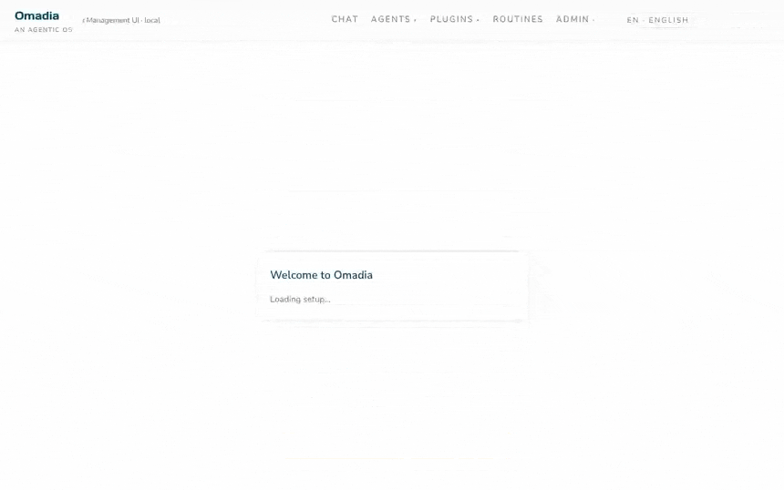

<div align="center">


### An Agentic OS for professionals

[](LICENSE)
[](#status--roadmap)
[](#-quickstart)
[](https://www.typescriptlang.org/)
[](CONTRIBUTING.md)
[](https://github.com/byte5ai/omadia/stargazers)

[**Website**](https://omadia.ai) · [**Quickstart**](#-quickstart) · [**Why omadia?**](#why-omadia) · [**Docs**](docs/) · [**Contributing**](CONTRIBUTING.md)

</div>

**omadia is a self-hostable, multiplayer agentic OS that makes AI dependable
enough for real work.** A team of agents runs on infrastructure you own and works
inside your team's shared channels, so several people collaborate with the same
agents in one context, not a private one-on-one chatbot. The agents turn your
data, software, and people into results you can steer, audit, and prove. By
default, the Privacy Shield keeps the raw results of data-source tools on your
server. It acts in the model requests a turn makes itself, from the agent's
model loop and its sub-agents to the answer verifier's checks, and in the
requests of the memory jobs. In a turn's requests the model works from an
identity-free digest of each tool result, apart from a few exempt tools such
as `read_attachment` (it refuses tables) and any tool an operator sets to
bypass the shield, and gets tool errors redacted, apart from the errors a
bypassed tool returns. The earlier answers a channel
replays and recalled context are masked there whatever the settings. Your own
messages, text from uploads and the user messages a channel replays are masked
there only once you switch on prompt masking
(`mask_user_prompt`, default off). The inbound security screener and turn
scoring get the turn's text as the turn's model saw and wrote it, masked by
the same rules. The stored memories and earlier turns the memory jobs send to
their own model (the recall relevance judge, the session briefing,
topic-cluster naming, the inconsistency detector and the Teams topic detector)
are masked whatever the settings, and a job that cannot mask skips its model
call. Every other model call sends its text as it is, with prompt masking on
or off. That covers the embedding of stored memories and plugin calls through
`ctx.llm` such as the canvas composer and the plan runner. Images you attach go to an
image-capable model unmasked,
and agents on the Claude subscription CLI run without the shield. The
exceptions are listed under [Trust & privacy](#trust--privacy-architecture).
An optional answer verifier, off by default, checks an answer against its
sources only when one of its trigger patterns matches, such as a euro amount,
an accounting reference or a date written as `2026-10-02`. An answer whose
only figures come in other formats, like `$500` or `October 2, 2026`, is not
checked unless an aggregate keyword such as `total` stands in it. In its
default `shadow` mode the verifier only records a verdict. On the Postgres
backend, each turn in which the shield acted appends a hash-chained receipt.
Writing it is best-effort: a failed write is logged, and the turn completes
without a receipt. Bring your own LLM key and switch providers by config,
not code.

---

## Prerequisites

The quickstart runs entirely in containers, so the host stays light:

- **Docker 24+** with the Docker Compose v2 plugin (the `docker compose`
  subcommand, not the legacy `docker-compose` binary)
- **Git**, to clone the repository

That is the whole list for running omadia. A local Node toolchain is only
needed when you build the services from source or develop plugins:

- **Node 22.x** for the middleware and admin UI outside Docker. The pinned
  version lives in `.nvmrc`, so `nvm use` picks it up. The middleware blocks
  installation on a mismatched major version, because native modules are
  built against a specific ABI.

See [`CONTRIBUTING.md`](CONTRIBUTING.md) for the full from-source setup.

> **⚠️ Deploying anywhere other than local `docker compose up`?** The shipped
> image runs with `NODE_ENV=production`, and since v0.115 the middleware
> refuses to boot unless **two** secrets are set: `VAULT_KEY` **and**
> `CREDENTIAL_KEYCHAIN_KEY` (each `openssl rand -base64 32`, two different
> values, never rotated casually). The Render blueprint and `fly/deploy.sh`
> generate both; on a self-managed host set them yourself before first boot.
> Missing either one fails the boot health gate, and on an existing
> instance the rolling updater then rolls back to the previous version. See
> [Deployment](#deployment) and [Troubleshooting](#troubleshooting).

## ⚡ Quickstart

```bash
git clone https://github.com/byte5ai/omadia.git && cd omadia

# 1. Bring up the minimal core: postgres + middleware + admin UI.
#    Images are pulled prebuilt from GHCR, so first boot is a download,
#    not a source build. No config needed to start.
docker compose up -d

# 2. Copy the one-time setup token the middleware printed at start.
#    The first-admin wizard only accepts it, so nobody else can claim
#    your fresh install.
docker compose logs middleware | grep "setup token"

# 3. Open the admin UI and complete the first-admin wizard with that token.
open http://localhost:3333
```

`docker compose up -d` pulls exactly three services and nothing else. Open the UI,
create the first admin with the setup token, connect your LLM under
**Admin → LLM access**, and run your first agent team. The next section is
the 90-second "wow moment". Diagrams, embeddings, and object storage are opt-in
(see [Optional features](#optional-features)). Prefer to choose the token
yourself? Set `ADMIN_SETUP_TOKEN` (16+ characters) in `middleware/.env` before
the first start.

Pin a specific release instead of the latest with the `OMADIA_VERSION` shell
variable (or a project-root `.env` file, not `middleware/.env`), or build the
images from source instead of pulling:

```bash
OMADIA_VERSION=v0.3.0 docker compose up -d                              # pin a release
docker compose -f docker-compose.yaml -f docker-compose.build.yaml up -d --build  # build locally
```

> **Pull fails with `manifest unknown`?** The GHCR images publish on each
> release, so a brand-new checkout can briefly predate the first published
> image. Build from source with the `--build` line above until a release lands.

### No Docker? Let your AI assistant install it

Prefer not to touch a terminal? If you have the **Claude** desktop app (or
another AI assistant that can run commands on your machine, such as Codex), paste
the prompt below into a chat. The assistant fetches a public skill file and
installs the native omadia desktop app (no Docker, no build tools) from the
newest GitHub Release that has a build for your OS, then opens the onboarding
wizard for you. On a Mac the app needs macOS 13 (Ventura) or later; the skill
checks this before it downloads anything.

```text
Install omadia on my machine by following this skill file, step by step:
https://raw.githubusercontent.com/byte5ai/omadia/main/docs/onboarding/SKILL.md
```

On a **Claude Pro/Max** subscription you can pick the CLI-subscription provider in
the wizard instead of a metered API key — provided the `claude` CLI is installed
and signed in on the same machine (omadia detects it there). Otherwise the API-key
option always works. See
[`docs/onboarding/SKILL.md`](docs/onboarding/SKILL.md) for exactly what it runs.

## 🎬 The 2-minute pitch

https://github.com/user-attachments/assets/644f9dae-c8a9-44af-a47f-183d2fcdcf34

## 🚀 First run: from prompt to audit receipt

<div align="center">



<sub>Describe an agent in plain words → the builder generates it → try it out. No code.</sub>

</div>

omadia clicks once you watch a team of agents do real work and hand you a receipt
for it:

1. Run **`docker compose up -d`**. The minimal core (postgres, middleware, admin UI) comes up together.
2. **Open `http://localhost:3333`** and finish the first-admin `/setup` wizard
   with the setup token from `docker compose logs middleware`.
3. **Start a demo agent team** from a single prompt in the web chat.
4. **Watch it work.** The orchestrator streams turns and dispatches tools across
   the agents in the team.
5. **Open the run's trace.** The per-run call-stack viewer shows every step, tool
   call and decision of the run. The trace is telemetry. The audit record is the
   hash-chained receipt under `/operator/receipts` (Postgres backend), written
   best-effort for each turn in which the Privacy Shield acted. A turn whose
   receipt write failed has none, and the server log records the failure.

## Why omadia?

omadia is built for the moment an agent system leaves the laptop and meets real
work: ownership, auditability, and a clean fit into an existing stack. The first
three rows are why teams choose it; the rest is the groundwork done properly.

| Capability | What you get |
|---|---|
| 🛡️&nbsp;**Privacy&nbsp;Shield** | Raw results of data-source tools stay behind a data-plane boundary. The shield acts in a turn's own model requests, from the agent's loop and its sub-agents to the verifier's checks, and in the memory jobs' requests. In a turn's requests the LLM works from an identity-free digest of each tool result and gets tool errors redacted or withheld, and a result the shield cannot intern is withheld. `guarded` by default, with `bypass`, `per_tool` and a per-MCP-server bypass as opt-ins and an org-wide clamp (`OMADIA_PRIVACY_FORCE_GUARDED`) that also covers knowledge-graph ingestion of MCP results. `read_attachment` (uploaded documents; it refuses tables and points the model to `query_dataset`) and a short allowlist of the agent's own tools return their results in clear, while their errors are redacted or withheld like any tool's; the errors a bypassed tool returns reach the model as they are. The answers a channel replays as chat history and recalled context are masked there whatever the settings, because an answer the shield rendered carries real values. Your messages and the user messages a channel replays are masked there only while prompt masking (`mask_user_prompt`, off by default) is on, so by default they reach the model as typed. The inbound security screener and turn scoring get the turn's text as the turn's model saw and wrote it. The stored text the memory jobs send to their own model (the recall judge, the session briefing, cluster naming, the inconsistency and topic detectors) is masked whatever the settings, and a job that cannot mask skips its model call. Every other model call sends its text as it is, with masking on or off, from the embedding of stored memories to plugin calls through `ctx.llm` such as the canvas composer and the plan runner. Attached images go to an image-capable model unmasked, and the Claude subscription CLI (`claude-cli`) runs without the shield. |
| ✅&nbsp;**Answer&nbsp;verification** | Optional and off by default (`verifier_enabled`). Once switched on, it checks an answer against the run's own sources only if one of its trigger patterns matches, such as a euro amount, an accounting reference like `INV/2026/0042` or a date written as `2026-10-02`, and records a verdict. Figures in other formats, such as other currencies or English-format dates, match no trigger pattern unless the answer also holds an aggregate keyword such as `total` and a number of three or more digits. An answer in which the verifier finds nothing to check is `skipped`, a verifier that could not run is `unavailable`, and `approved` means that every claim the verifier extracted was checked and confirmed. The default mode, `shadow`, only records. `enforce` holds each answer until its verdict, delivers an answer the verifier confirmed and withholds one it could not confirm. An answer that no trigger pattern matched, or in which the extraction found no claim, goes out unchecked in `enforce` too, and so does a turn that carries an input card. |
| 🧮&nbsp;**Excel&nbsp;from&nbsp;real&nbsp;rows** | `create_xlsx` writes the real rows behind a `datasetId` into the workbook server-side, so they never pass through the model, and adds sums and pivots as Excel formulas. omadia runs no spreadsheet engine of its own: the workbook asks the spreadsheet application to recalculate when it opens the file, and that application computes every formula result. |
| 🧾&nbsp;**Traces&nbsp;and&nbsp;receipts** | The call-stack viewer shows a run step by step, with each tool call and decision. That trace is best-effort telemetry, so a run can lack one. Privacy receipts (`/operator/receipts`, Postgres backend) are hash-chained and written best-effort, one for each turn in which the privacy shield acted. A failed write is logged and not retried, and a receipt that was never written leaves no gap in the chain. |
| 👥&nbsp;**Multiplayer&nbsp;by&nbsp;design** | Agents run in your team's shared channels (Slack, Teams, Telegram, Discord), so several people work with them in one context, not a private one-on-one chatbot. |
| 🤖&nbsp;**Agent&nbsp;teams,&nbsp;not&nbsp;one&nbsp;chatbot** | An orchestrator routes each turn to the right specialist plugin agent. Channels, integrations, tools, and capability providers sit behind one stable API. |
| 🔒&nbsp;**Self-hosted&nbsp;and&nbsp;yours** | One `docker compose up` on a single machine. Your Postgres, your LLM key, all of the data on your own infrastructure. GDPR-aware and made in the EU. |
| 🧩&nbsp;**Hash-pinned&nbsp;plugins** | Plugins are ZIP files. Their dependencies are bundled in the ZIP or come from the omadia image. A registry download must match the SHA-256 listed in that registry's index. There is no publisher signature yet, so trust rests on the registries you configure and the ZIPs you upload. Installed plugin code never comes from npm at runtime. §4 of the [security architecture](docs/security-architecture.md) lists where omadia itself runs npm, including the Builder template that previews load. |
| 🔌&nbsp;**Enterprise&nbsp;integrations** | Microsoft 365, Odoo, Confluence, Teams, and Telegram, with the LLM provider a swappable plugin. |

## What's in the box

- **Privacy Shield**: a data-plane boundary that interns the raw results of
  data-source tools and gives the LLM an identity-free digest of them, with the
  limits listed under [Trust & privacy](#trust--privacy-architecture)
  ([`harness-plugin-privacy-guard`](middleware/packages/harness-plugin-privacy-guard),
  [`privacyMode.ts`](middleware/packages/plugin-api/src/privacyMode.ts))
- **Answer verifier** (optional, off by default): checks answers that match
  its trigger patterns, such as euro amounts and dates, against their sources
  and records a verdict. In `enforce` mode it withholds an answer whose claims
  it could not confirm and lets an answer that matched no pattern go out
  unchecked
  ([`harness-verifier`](middleware/packages/harness-verifier),
  [`verifierService.ts`](middleware/packages/harness-orchestrator/src/verifierService.ts))
- **Office files**: `create_xlsx` / `create_docx` build real spreadsheets and
  documents server-side, resolving dataset rows without routing them through the
  model; the spreadsheet application calculates the formulas when it opens the
  file ([`harness-plugin-office`](middleware/packages/harness-plugin-office))
- **Plugin runtime**: channels, integrations, tools, sub-agents, and capability
  providers; everything is a plugin behind a stable API surface
  ([`@omadia/plugin-api`](middleware/packages/plugin-api))
- **Builder**: UI-driven plugin authoring with codegen, slot-typecheck,
  in-process ESLint auto-fix, and a runtime smoke harness
- **Knowledge graph**: pgvector-backed (Postgres) with an in-memory
  alternative for tests
- **Channels**: web-chat (admin UI) is in-tree; Teams and Telegram ship as
  separately-distributed plugin ZIPs
- **Auth**: multi-provider login (local password + OIDC), per-provider
  user table, admin UI for provider toggle and user management
- **Routines**: user-authored cron-triggered agent runs with a full per-run
  trace and call-stack viewer

## Design

The operator UI speaks Lume, omadia's own visual language. The idea is that
light is the material: surfaces read as condensed out of light, and the
agent's attention shows up as accent-tinted illumination, not as flat color.
Four recipes carry it. Surfaces are gradient pairs, borders catch the light on
their top edge, one accent slot glows to mark focus and selection, and corners
stay soft.

Three accent palettes ship, Petrol, Atelier, and Lagoon as the default. The
operator picks one and switches between light and dark from the header. The
whole theme lives in a single token file (`web-ui/app/_lib/theme.css`), so
restyling stays a change at the token tier rather than a sweep through
components.

Lume is specified in [byte5ai/omadia-ui](https://github.com/byte5ai/omadia-ui)
under `docs/visual-spec.md`, the same language omadia's canvas app is built on.
The operator UI and the canvas app share one identity.

## Architecture

```
         ┌────────────────────────────────────────────────────────────┐
         │                       Channels                             │
         │  web-chat   Teams   Telegram   …                           │
         └────────────────────┬───────────────────────────────────────┘
                              │  ChannelSDK (SemanticAnswer)
                              ▼
         ┌────────────────────────────────────────────────────────────┐
         │                      Orchestrator                          │
         │  routes turns to agents, manages tool dispatch, streaming  │
         └────────────────────┬───────────────────────────────────────┘
                              │  ctx (PluginContext)
                              ▼
         ┌────────────────────────────────────────────────────────────┐
         │                        Plugins                             │
         │  agents  ·  tools  ·  capability providers  ·  integrations│
         └────────────────────┬───────────────────────────────────────┘
                              │
        ┌─────────────────────┴────────────────────────────┐
        ▼                     ▼                            ▼
  Knowledge Graph       Embeddings                  Vault (secrets)
  (Postgres + pgvector) (Ollama / API)              (AES-256-GCM file)
```

Start with the [architecture overview](docs/architecture.md) for the component
map and request flow. The deeper walk-through of the plugin loading sequence,
capability registry, and multi-provider authentication layer lives under
[`docs/`](docs/).

## Trust & privacy architecture

Three subsystems let omadia put real data in front of an LLM and stand behind the
answer:

- **Privacy Shield (data-plane boundary)**: the raw results of data-source tools
  are interned behind the boundary, and the LLM works from an identity-free
  digest of them. A result the shield cannot intern is withheld, and the model
  gets a notice in its place. `guarded` is the default. Setting a plugin to
  `bypass` or `per_tool`, or flagging an MCP server for privacy bypass, is an
  explicit opt-in, and `OMADIA_PRIVACY_FORCE_GUARDED` clamps each of them back
  to `guarded` org-wide for the results the model gets. The clamp covers the
  knowledge-graph ingestion of MCP results too: while it is set, an MCP server
  flagged for both ingestion and privacy bypass stores a value-free note of
  each result's shape instead of up to 8,000 characters of the raw result.
  Pseudonyms resolve back to real
  values only at materialization. Each bypass is recorded on the turn's
  receipt on a best-effort basis (the bypass applies even when recording it
  fails), and receipts are persisted best-effort.

  The shield acts in the model requests a turn makes itself, which are
  the agent's model loop, its sub-agents and the verifier's requests about
  the answer, and in the requests of the memory jobs (below). Under `guarded`
  it replaces each tool result in a turn's requests with the
  digest. It redacts the `Error:` text a tool returns, or withholds it whole,
  and it withholds the message of a tool that throws. It masks prompt text
  only while an operator has switched on prompt masking (`mask_user_prompt`,
  default off). The user's message, text inlined from uploads, the user
  messages a channel replays and a direct-line relay are
  then masked, and so is the text the turn's routing, fact-extraction and
  memory-excerpt passes read. Masking finds values such as e-mail addresses,
  IBANs, phone numbers, amounts and dates by pattern, plus the terms on the
  operator's deny-list, and names only through the optional C1 detector. If
  the pattern pass fails, the request is blocked instead of being sent
  unmasked. If C1 fails during a turn, the rest of that turn runs on the
  patterns alone, and names only C1 would find reach the model as typed.
  With masking off, the user's own message, text inlined from uploads and
  the user messages a channel replays (`priorTurns`) reach the model as
  typed. The earlier answers a channel replays, as the Teams and Telegram
  channels do, and recalled context, which carries answers stored with their
  real values, are masked whether prompt masking is on or off, because an
  answer the shield rendered carries real values the model never saw: e-mail addresses, IBANs, phone numbers, postal addresses and ID
  numbers by pattern, the deny-list terms and names through C1, while dates
  and amounts stay readable. The reply gets the real values back.

  Some tool results skip the digest and the redaction. The text of an
  uploaded document that `read_attachment` returns (it refuses an upload it
  recognises as a table by type or name, CSV or XLSX, and points the model
  to `query_dataset`) and the results of a short
  allowlist of the agent's own tools (`memory`, the stored-process tools,
  `suggest_follow_ups`, `ask_user_choice`) reach the model in clear, and so
  do the errors these tools return or throw. A tool an operator set to bypass
  hands the model its result and the errors it returns as they are, while a
  message it throws is still withheld.

  Under the default security posture (`auto`), the inbound security screener
  sends the user's message, the user messages a channel replays and the names
  and types of attached files to the agent's own model, or to a screening
  proxy the operator configured, on every turn that carries an upload. It gets
  them masked like the turn's own model call: the messages and the file names
  go through the turn's prompt masking, so they arrive as typed while
  `mask_user_prompt` is off, and a turn whose masking fails is refused before
  anything is screened. At the default capture level, the memory plugin sends
  each turn it stores to its own provider for a significance score, as the
  turn's model saw and wrote it: the message masked like the prompt and the
  answer with the shield's surrogates, not the real values restored for you.

  The memory plugin's jobs send stored memories and earlier turns, which hold
  real values, to its own provider: the recall relevance judge filters
  recalled context, the session briefing summarises an earlier session,
  topic-cluster naming and the inconsistency detector compare memories, and
  the Teams topic detector reads the previous exchange. With a privacy guard
  installed that text is masked whether prompt masking is on or off, like a
  replayed answer: e-mail addresses, IBANs, phone numbers, postal addresses
  and ID numbers by pattern, the deny-list terms and names through C1. The
  judge and the briefing run inside the turn and mask through its map; the
  other jobs run outside a turn and mask through a map of their own per run.
  A session summary, a cluster name or an inconsistency summary gets the real
  values back. If masking fails, or the installed privacy guard predates it
  (privacy guard 0.8.0), the job skips its model call; without a privacy
  guard the jobs send the text as stored.

  Every other model call sends its text as it is, with prompt masking on or
  off. A significance backfill an operator starts over stored turns sends them
  as stored. With the OpenAI-compatible embedding adapter, stored turns and
  memories are embedded at that provider as stored, real values included, and
  masking them is still open. Through `ctx.llm`, the canvas composer and the plan-runner's
  planning check send the user's message before the turn starts. Images the
  user attaches are not masked in any request, because the shield reads text
  only. Agents on the Claude subscription CLI (`claude-cli`) run without the
  shield, and `agents.privacy_profile` is not a shield setting
  ([`docs/security-architecture.md`](docs/security-architecture.md) §3a, §6b,
  §6c, §6d, §6f, §7b).
  Spec: [`specs/001-privacy-shield-v4/`](specs/001-privacy-shield-v4/).
- **Answer verification (optional)**: off by default (`verifier_enabled`), and
  switching it on also needs an API key for the verifier's model provider. The
  verifier checks an answer only if one of its trigger patterns matches
  (`shouldTriggerVerifier`). The patterns look for euro amounts, accounting
  references such as `INV/2026/0042`, dates written as `2026-10-02` or
  `02.10.2026`, percentages, hour and day counts such as `42,5 Stunden`, and an
  aggregate keyword such as `Summe` or `total` in an answer that also holds a
  number of three or more digits. A figure in any other format, such as
  `USD 50,000`, `$500`, `October 2, 2026` or `3 unpaid invoices`, matches none
  of them on its own. The patterns are regular expressions over the whole
  answer, so the keyword and the number need not belong together:
  `Total: $500` is checked, `$500` alone is not. For an answer that matches,
  the verifier checks the claims its extraction model lists against the run's
  sources and records a verdict. An answer in which it finds nothing to check
  is `skipped`, and a verifier that
  could not run is `unavailable`. Neither is reported as `approved` or shown as
  verified. A claim no checker takes, claims beyond the per-answer cap, text
  beyond the part of the answer the claim extractor reads, and a returned claim
  that does not quote the answer or is too long to check whole all stay in the
  verdict as not checked, so such an answer is at most partly verified. No
  claim is shortened to fit a check, and a claim the extraction model leaves
  out is not seen by any check. In the default `shadow` mode the verifier only
  records, and every answer goes out as written. `enforce` holds each answer
  until its verdict, on the stream too. It delivers an answer the verifier
  confirmed and replaces one it could not confirm with a notice that the
  answer was withheld. An answer that no trigger pattern matched, or in which
  the extraction found no claim, goes out unchecked in `enforce` too, unless a
  check that needs no extraction blocks it (a failure the answer reports
  without evidence from this turn, a tool result that broke its declared
  schema, missing citations for knowledge-graph evidence). A withheld answer
  is still stored and can reach a later turn's context.
  `enforce` gives a contradiction at most one correction retry, none on canvas
  streams or with `verifier_max_retries` set to 0, and on the non-streaming
  path it gives a borderline answer a second sample. Both re-generate the
  answer from the first run's recorded tool results. They replay every
  recorded external call and execute none of those calls again. A sub-agent
  whose data the shield interned runs again, but its own tool calls replay
  too, and a re-entry that needs a new call other than a kernel read is
  abandoned. Without that replay ledger, which `enforce` binds only when it
  may re-enter, the MCP client retries a call once after a transport failure,
  so an MCP write whose reply was lost can run twice. An answer the shield
  rendered with real values is never sent to the verifier, so `enforce`
  withholds it, unless the turn carries an input card: the card exemption runs
  first, and a turn with an input card goes out unchecked, a rendered answer
  included. Agents on the Claude subscription CLI and routines are not
  verified ([`docs/security-architecture.md`](docs/security-architecture.md)
  §6e, §7c).
- **Office files from real rows**: when a specialist agent returns a
  `datasetId`, `create_xlsx` resolves the rows server-side and writes them into
  the workbook without passing them through the model. Sums and pivots go in as
  Excel formulas, and omadia does not evaluate them. A formula cell carries no
  cached result, and the workbook asks the spreadsheet application to
  recalculate on open, so the application that opens the file computes every
  figure. A formula that would reach outside the workbook is refused. `.docx`
  output is laid out from the text the model writes and computes nothing.

### Optional features

The minimal core is postgres + middleware + admin UI. Diagrams, embeddings, and
object storage are off by default. Each is an overlay file you add with `-f`,
which starts the sidecar and switches on the matching plugin.

```bash
# Object storage (MinIO): chat attachment ingestion
docker compose -f docker-compose.yaml -f docker-compose.storage.yaml up -d

# Diagram rendering (Kroki). Needs object storage, so add both overlays:
docker compose -f docker-compose.yaml \
  -f docker-compose.storage.yaml -f docker-compose.diagrams.yaml up -d

# In-tenant embeddings (Ollama). First boot pulls nomic-embed-text (~270 MB),
# so it needs network access the first time it starts.
docker compose -f docker-compose.yaml -f docker-compose.embeddings.yaml up -d

# Everything at once
docker compose -f docker-compose.yaml \
  -f docker-compose.storage.yaml -f docker-compose.diagrams.yaml \
  -f docker-compose.embeddings.yaml up -d
```

> **Diagram rendering** also needs a signing secret. Generate one and add it to
> `middleware/.env` as `DIAGRAM_URL_SECRET` before starting the diagrams overlay:
> `openssl rand -hex 32`. The plugin stays inactive until it is set.

## Plugin development

**Start here: [`byte5ai/omadia-plugin-starter`](https://github.com/byte5ai/omadia-plugin-starter).**
A ready-to-fork template for your own omadia plugin. Clone it, fill in your logic
against [`@omadia/plugin-api`](middleware/packages/plugin-api), and ship.

omadia plugins are ZIP files that the operator uploads through the admin UI.
Plugins never come from an npm registry at runtime. A package can bundle its
own `node_modules`, and whatever it does not bundle, `@omadia/plugin-api`
included, resolves from the omadia image. Two reference plugins are also
shipped in-tree as starting points:

- [`agent-reference-maximum`](middleware/packages/agent-reference-maximum):
  exercises every capability in the plugin API
- [`agent-seo-analyst`](middleware/packages/agent-seo-analyst): a smaller,
  focused tool-only example

The Builder UI walks operators through cloning either reference, slot-filling
the differentiating logic, and verifying with the smoke runner before install.

## Deployment

- **Local / single-tenant**: `docker compose up`, see Quickstart above
- **One-click cloud**: deploy the minimal core into your own Render
  workspace — [`render.yaml`](render.yaml) provisions the middleware,
  admin UI, and Postgres (pgvector), and generates `VAULT_KEY` and
  `CREDENTIAL_KEYCHAIN_KEY`. On first boot the middleware log shows the one-time
  setup token the first-admin `/setup` wizard asks for; your LLM is connected
  afterwards under **Admin → LLM access**. Runs on paid instance types (the
  middleware needs a persistent disk).

  [](https://render.com/deploy?repo=https://github.com/byte5ai/omadia)

- **One-command Fly.io**: Fly has no blueprint-style deploy button, so the
  equivalent is one command. [`fly/deploy.sh`](fly/deploy.sh) provisions
  three apps in your Fly org — middleware (persistent `/data` volume),
  admin UI, and a private [`pgvector/pgvector`](https://hub.docker.com/r/pgvector/pgvector)
  Postgres (the same image the compose stack uses; Fly's own Postgres
  offerings either lack pgvector or gate it behind a dashboard toggle) —
  generates `VAULT_KEY`, `CREDENTIAL_KEYCHAIN_KEY` and the database password,
  and deploys the GHCR
  images. Needs a logged-in `flyctl`; roughly $10/month. The `/setup` wizard
  then asks for the setup token from `fly logs -a <middleware-app>`:

  ```bash
  git clone https://github.com/byte5ai/omadia.git && cd omadia
  ./fly/deploy.sh
  ```

- **Bring-your-own**: the runtime is a stock Node + Postgres app; any host
  that can run both works (Kubernetes, ECS, plain VM).

> **Required production secrets.** The shipped image runs with
> `NODE_ENV=production`, which makes **two** keys mandatory at boot:
> `VAULT_KEY` (secret vault) and, since v0.115, `CREDENTIAL_KEYCHAIN_KEY`
> (credential keychain — a separate trust domain, so a separate key). Without
> either the middleware refuses to start (this is intentional; the dev
> fallback writes the master keys into the data volume, which is not safe at
> rest). Generate each with `openssl rand -base64 32` and wire both as
> platform secrets before the first deploy. Upgrading an existing instance
> from a version older than v0.115? Add `CREDENTIAL_KEYCHAIN_KEY` **before**
> pulling the new image, or the boot health gate fails and the rolling
> updater rolls back. The bundled `docker-compose.yaml` pins
> `NODE_ENV=development` so the dev fallback stays available for local
> `docker compose up` without configuration; drop that override (and set
> `VAULT_KEY` in `.env`) when you re-use the compose file as a starting
> point for a non-local deploy.

## Status & Roadmap

> **Status: pre-1.0.** Public preview. APIs and database schemas may break
> between minor versions until `1.0.0`. Production use of the OSS distribution
> is supported but the upgrade path is hand-rolled today; an automated
> migration runner is on the v1.0 roadmap.

Stability promises are **scoped to the documented plugin API only**; everything
else (database schema, internal service surfaces, admin-UI routes) may evolve
without notice until `1.0.0`.

Active development tracks:

- **Conductor**: shipped — a deterministic workflow engine (graph of agent /
  action / human steps) with durable human approvals, crash-safe resume,
  operator run cancellation, and a visual designer at `/conductor`. See
  `specs/005-omadia-conductor/` and `docs/architecture.md`.
- **Plugin marketplace**: discovery and publisher-signed packages (post-1.0;
  today a package is pinned by its SHA-256)
- **Multi-tenant hosting**: out of scope for v1; a separate fork is planned
- **Web-IDE for plugin development**: moves the Builder authoring loop into the
  management UI without round-tripping through ZIP uploads (post-1.0)

## License

[MIT](LICENSE). Copyright (c) 2026 byte5 GmbH.

Third-party dependency licenses and notices are documented in
[`THIRD_PARTY_NOTICES.md`](THIRD_PARTY_NOTICES.md). The dependency tree is
free of GPL, AGPL, and SSPL packages; weak-copyleft components (LGPL via
`sharp-libvips`, MPL-2.0 via `axe-core` / `lightningcss` / `dompurify`) are
used as documented unmodified dependencies.

## Troubleshooting

**Port already in use.** The core binds `3333` for the admin UI plus the
Postgres port. If another process holds one of them, the affected container
exits on start. Free the port, or remap it in your own compose override, then
re-run `docker compose up -d`.

**`VAULT_KEY` or `CREDENTIAL_KEYCHAIN_KEY` missing at boot.** A production
image (`NODE_ENV=production`) refuses to start without both keys, on purpose
(`CREDENTIAL_KEYCHAIN_KEY is required when NODE_ENV=production` is the
message since v0.115). Generate each with `openssl rand -base64 32` and set
them as secrets before deploying.

**Update rolled back with `health gate failed: never_reachable`.** The new
image never answered `/health` within the gate window, so the updater restored
the previous version — the instance keeps running. The most common cause is a
secret the new version requires at boot that the old one did not, above all
`CREDENTIAL_KEYCHAIN_KEY` when coming from a version older than v0.115. Check
the middleware logs from the failed boot right away (hosted log retention is
short), add the missing secret, and re-run the update. The
bundled `docker-compose.yaml` pins `NODE_ENV=development`, so a local `docker
compose up` keeps the dev fallback. Full context lives in
[Deployment](#deployment).

**Optional overlay not found.** Optional features are overlay files added with
repeated `-f` flags, not Compose profiles. Pass the full filename, for example
`-f docker-compose.yaml -f docker-compose.storage.yaml`. A bare `--profile
storage` matches nothing here.

**Node version mismatch from source.** The middleware pins its Node major
version in `.nvmrc` and stops `npm install` on a different one, because
`better-sqlite3` and other native modules are compiled against a specific ABI.
Run `nvm use` in the repository root before installing.

## Contributing

See [`CONTRIBUTING.md`](CONTRIBUTING.md) for the dev setup, commit-message
convention, and pull-request workflow. The
[`CODE_OF_CONDUCT.md`](CODE_OF_CONDUCT.md) (Contributor Covenant 2.1) applies
to all interactions in issues, pull requests, and discussions.

## Security

Found a vulnerability? **Please do not open a public issue.** See
[`SECURITY.md`](SECURITY.md) for the coordinated-disclosure process and the
private contact channel.

## Maintainership

omadia is maintained by [byte5 GmbH](https://byte5.de) under the GitHub
organisation [`byte5ai`](https://github.com/byte5ai). Outside contributions
are welcome; see [`CONTRIBUTING.md`](CONTRIBUTING.md).
